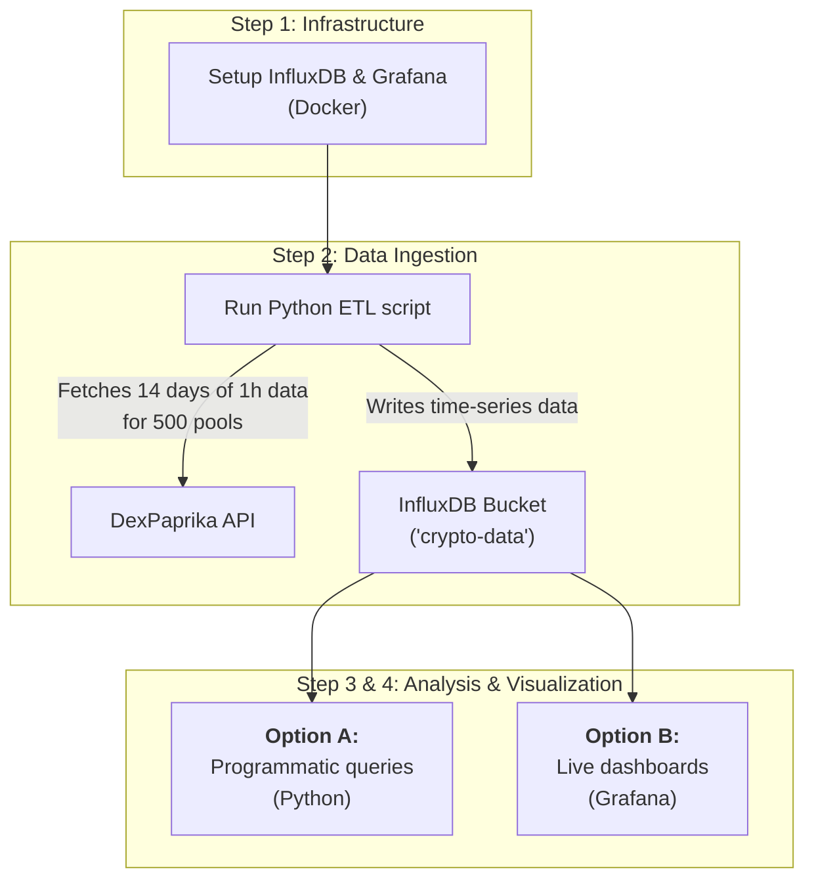

## From real-time monitoring to historical analysis

While InfluxDB is a champion of real-time data, its power extends far beyond live dashboards. It provides a highly optimized engine for storing and querying massive time-series datasets, making it a perfect middle-ground between the local analytics of DuckDB and the enterprise scale of ClickHouse.

<Note>
Looking for other analytics solutions? Check out our full list of [API Tutorials](/tutorials/tutorial_intro) for more step-by-step guides.
</Note>

This tutorial will guide you through building a production-grade ETL pipeline to populate InfluxDB with a substantial historical dataset, enabling both high-performance queries and real-time visualization.



**The goal:**
By the end of this guide, you will have a scalable analytics pipeline that can:
1. Ingest 1-hour OHLCV data for the top 500 Uniswap v3 pools over a 14-day period.
2. Run complex time-series analysis using Python and the Flux language.
3. Visualize the data in a live-updating Grafana dashboard.

<CardGroup cols={2}>
  <Card
    title="Step 1: Docker Setup"
    icon="docker"
    href="#step-1-setting-up-influxdb-and-grafana"
  >
    Get InfluxDB and Grafana running in seconds with Docker.
  </Card>
  <Card
    title="Step 2: ETL Pipeline"
    icon="arrows-rotate"
    href="#step-2-build-the-python-etl-pipeline"
  >
    Create a robust data pipeline for ingesting large time-series datasets.
  </Card>
  <Card
    title="Step 3: Programmatic Analysis"
    icon="code"
    href="#step-3-programmatic-analysis-with-python"
  >
    Analyze your time-series data with InfluxDB's Python client.
  </Card>
  <Card
    title="Step 4: Live Dashboard"
    icon="chart-line"
    href="#step-4-visualizing-data-in-grafana"
  >
    Build a real-time dashboard to monitor crypto pools.
  </Card>
</CardGroup>

---

## Step 1: Setting Up InfluxDB and Grafana

We'll use Docker Compose to spin up both services. First, create a new directory named `INFLUXDB` in your project root. Inside that directory, create a file named `docker-compose.yml` with the following content.

```yml INFLUXDB/docker-compose.yml
services:
  influxdb:
    image: influxdb:2.7
    container_name: influxdb
    ports:
      - "8087:8086"
    volumes:
      - influxdb-data:/var/lib/influxdb2
    environment:
      - DOCKER_INFLUXDB_INIT_MODE=setup
      - DOCKER_INFLUXDB_INIT_USERNAME=my-user
      - DOCKER_INFLUXDB_INIT_PASSWORD=my-password
      - DOCKER_INFLUXDB_INIT_ORG=my-org
      - DOCKER_INFLUXDB_INIT_BUCKET=crypto-data
      - DOCKER_INFLUXDB_INIT_ADMIN_TOKEN=my-super-secret-token

  grafana:
    image: grafana/grafana:latest
    container_name: grafana
    ports:
      - "3000:3000"
    volumes:
      - grafana-data:/var/lib/grafana

volumes:
  influxdb-data:
  grafana-data:
```

Run the following command from the root of the project to start the containers:
```bash
docker-compose -f INFLUXDB/docker-compose.yml up -d
```

Once running, you can access:
- **InfluxDB UI:** `http://localhost:8087`
- **Grafana UI:** `http://localhost:3000` (login with `admin`/`admin`)

Use the token `my-super-secret-token` to connect to InfluxDB.

<Note>
We use port `8087` for InfluxDB to avoid potential conflicts with other services that might be using the default port `8086`.
</Note>

---

## Step 2: Build the Python ETL Pipeline

Create a new file named `INFLUXDB/build_influxdb_db.py`. This script is built to be robust and efficient, capable of ingesting large volumes of time-series data from the DexPaprika API into your InfluxDB instance. It leverages two key endpoints: the [Top Pools on a DEX endpoint](/api-reference/pools/get-top-x-pools-on-a-networks-dex) to discover pools, and the [Pool OHLCV Data endpoint](/api-reference/pools/get-ohlcv-data-for-a-pool-pair) to fetch historical price data.

```python INFLUXDB/build_influxdb_db.py [expandable]
import influxdb_client
from influxdb_client.client.write_api import SYNCHRONOUS
import requests
from datetime import datetime, timedelta, timezone
import time
import logging
import asyncio
import aiohttp
from typing import List, Dict
import math

# --- Configuration ---
API_BASE_URL = "https://api.dexpaprika.com"
NETWORK = "ethereum"
DEX_ID = "uniswap_v3"
HISTORY_DAYS = 14       # Fetch 14 days of OHLCV data
TOP_POOLS_LIMIT = 500   # Focus on top 500 pools by volume
BATCH_SIZE = 15         # Process pools in smaller batches
CONCURRENT_REQUESTS = 3 # Concurrent requests for API calls
OHLCV_API_LIMIT = 100   # API limit for OHLCV requests
INTERVAL = "1h"         # 1-hour intervals

# InfluxDB Configuration
INFLUX_URL = "http://localhost:8087"
INFLUX_TOKEN = "my-super-secret-token"
INFLUX_ORG = "my-org"
INFLUX_BUCKET = "crypto-data"

# Setup logging
logging.basicConfig(level=logging.INFO, format='%(asctime)s - %(levelname)s - %(message)s')

async def fetch_with_retry(session: aiohttp.ClientSession, url: str, params: Dict = None, retries=5, backoff_factor=1.0):
    """Generic async fetch function with exponential backoff."""
    for attempt in range(retries):
        try:
            async with session.get(url, params=params, timeout=30) as response:
                response.raise_for_status()
                return await response.json()
        except (aiohttp.ClientError, asyncio.TimeoutError) as e:
            if attempt == retries - 1:
                logging.error(f"Final attempt failed for {url}: {e}")
                raise
            sleep_time = backoff_factor * (2 ** attempt)
            logging.warning(f"Request to {url} failed: {e}. Retrying in {sleep_time:.2f}s...")
            await asyncio.sleep(sleep_time)
    return {}

class InfluxDBETL:
    def __init__(self):
        self.client = influxdb_client.InfluxDBClient(url=INFLUX_URL, token=INFLUX_TOKEN, org=INFLUX_ORG)
        self.write_api = self.client.write_api(write_options=SYNCHRONOUS)
        self.api_semaphore = asyncio.Semaphore(CONCURRENT_REQUESTS)
        self._ensure_bucket_exists()

    def _ensure_bucket_exists(self):
        """Checks if the bucket exists and creates it if not."""
        logging.info(f"Ensuring bucket '{INFLUX_BUCKET}' exists...")
        buckets_api = self.client.buckets_api()
        bucket = buckets_api.find_bucket_by_name(INFLUX_BUCKET)
        if not bucket:
            logging.warning(f"Bucket '{INFLUX_BUCKET}' not found. Creating it...")
            buckets_api.create_bucket(bucket_name=INFLUX_BUCKET, org=INFLUX_ORG)
            logging.info(f"Bucket '{INFLUX_BUCKET}' created successfully.")
        else:
            logging.info(f"Bucket '{INFLUX_BUCKET}' already exists.")

    def clear_bucket_data(self):
        """Deletes all data from the 'ohlcv' measurement in the bucket."""
        logging.info(f"Clearing existing data from measurement 'ohlcv' in bucket '{INFLUX_BUCKET}'...")
        try:
            delete_api = self.client.delete_api()
            start = "1970-01-01T00:00:00Z"
            stop = datetime.now(timezone.utc).strftime('%Y-%m-%dT%H:%M:%SZ')
            delete_api.delete(start, stop, '_measurement="ohlcv"', bucket=INFLUX_BUCKET, org=INFLUX_ORG)
            logging.info("Existing data cleared successfully.")
        except Exception as e:
            logging.error(f"Could not clear data from bucket: {e}")

    async def fetch_top_pools(self) -> List[Dict]:
        """Fetch top pools by volume from the specified DEX, handling pagination."""
        logging.info(f"Fetching top {TOP_POOLS_LIMIT} pools for {DEX_ID} on {NETWORK}...")
        all_pools = []
        page = 0
        async with aiohttp.ClientSession() as session:
            while len(all_pools) < TOP_POOLS_LIMIT:
                url = f"{API_BASE_URL}/networks/{NETWORK}/dexes/{DEX_ID}/pools"
                params = {"page": page, "limit": 100, "order_by": "volume_usd", "sort": "desc"}
                try:
                    data = await fetch_with_retry(session, url, params=params)
                    pools = data.get('pools', [])
                    if not pools:
                        break
                    all_pools.extend(pools)
                    logging.info(f"Fetched page {page}, got {len(pools)} pools. Total: {len(all_pools)}")
                    page += 1
                    if len(all_pools) >= TOP_POOLS_LIMIT:
                        all_pools = all_pools[:TOP_POOLS_LIMIT]
                        break
                    await asyncio.sleep(0.5)  # Be respectful to the API
                except Exception as e:
                    logging.error(f"Error fetching page {page}: {e}")
                    break
        logging.info(f"Finished fetching pools. Total: {len(all_pools)}")
        return all_pools

    async def fetch_pool_ohlcv_paginated(self, session: aiohttp.ClientSession, pool_address: str) -> List[Dict]:
        """Fetch complete OHLCV data for a pool using intelligent, dynamic windowing."""
        async with self.api_semaphore:
            final_end_time = datetime.now(timezone.utc)
            current_start_time = final_end_time - timedelta(days=HISTORY_DAYS)
            all_ohlcv = []

            try:
                if 'h' in INTERVAL:
                    interval_value = int(INTERVAL.replace('h', ''))
                    time_delta_per_call = timedelta(hours=OHLCV_API_LIMIT * interval_value)
                elif 'm' in INTERVAL:
                    interval_value = int(INTERVAL.replace('m', ''))
                    time_delta_per_call = timedelta(minutes=OHLCV_API_LIMIT * interval_value)
                else:
                    raise ValueError(f"Unsupported interval format: {INTERVAL}")
            except ValueError as e:
                logging.error(f"Invalid INTERVAL format: {e}. Defaulting to 1 hour.")
                time_delta_per_call = timedelta(hours=OHLCV_API_LIMIT * 1)

            total_expected_calls = math.ceil((final_end_time - current_start_time) / time_delta_per_call) if time_delta_per_call.total_seconds() > 0 else 0
            call_count = 0
            while current_start_time < final_end_time:
                call_count += 1
                batch_end_time = min(current_start_time + time_delta_per_call, final_end_time)
                
                logging.info(f"  [Pool {pool_address}] Fetching window {call_count}/{total_expected_calls}: {current_start_time.date()} to {batch_end_time.date()}")

                url = f"{API_BASE_URL}/networks/{NETWORK}/pools/{pool_address}/ohlcv"
                params = {
                    "start": current_start_time.strftime('%Y-%m-%dT%H:%M:%SZ'),
                    "end": batch_end_time.strftime('%Y-%m-%dT%H:%M:%SZ'),
                    "interval": INTERVAL,
                    "limit": OHLCV_API_LIMIT
                }
                try:
                    batch_data = await fetch_with_retry(session, url, params=params)
                    if batch_data:
                        for record in batch_data:
                            record['network'] = NETWORK
                            record['pool_address'] = pool_address
                        all_ohlcv.extend(batch_data)
                except Exception as e:
                    logging.warning(f"Could not fetch OHLCV batch for {pool_address}: {e}")
                
                current_start_time = batch_end_time
                await asyncio.sleep(0.75)  # Crucial delay to prevent rate-limiting
            
            logging.info(f"Pool {pool_address}: collected {len(all_ohlcv)} OHLCV records.")
            return all_ohlcv

    async def fetch_pool_ohlcv_batch(self, pool_addresses: List[str]) -> List[Dict]:
        """Fetch OHLCV data for multiple pools concurrently."""
        logging.info(f"Fetching {INTERVAL} OHLCV for {len(pool_addresses)} pools...")
        all_ohlcv = []
        async with aiohttp.ClientSession() as session:
            tasks = [self.fetch_pool_ohlcv_paginated(session, addr) for addr in pool_addresses]
            results = await asyncio.gather(*tasks, return_exceptions=True)
            for i, result in enumerate(results):
                if isinstance(result, list):
                    all_ohlcv.extend(result)
                elif isinstance(result, Exception):
                    logging.warning(f"OHLCV fetch failed for pool {pool_addresses[i]}: {result}")
        return all_ohlcv

    def load_ohlcv_data(self, ohlcv_data: List[Dict], pools_map: Dict):
        """Load OHLCV data into InfluxDB."""
        if not ohlcv_data:
            logging.warning("No OHLCV data to load.")
            return

        points = []
        for record in ohlcv_data:
            pool_id = record.get('pool_address')
            pair = pools_map.get(pool_id, "Unknown/Unknown")
            
            point = (
                influxdb_client.Point("ohlcv")
                .tag("pool_id", pool_id)
                .tag("pair", pair)
                .field("open", float(record['open']))
                .field("high", float(record['high']))
                .field("low", float(record['low']))
                .field("close", float(record['close']))
                .field("volume", float(record.get('volume', 0)))
                .time(record['time_close'])
            )
            points.append(point)
        
        if points:
            self.write_api.write(bucket=INFLUX_BUCKET, org=INFLUX_ORG, record=points)
            logging.info(f"Wrote {len(points)} data points to InfluxDB.")

    async def run_etl(self):
        """Run the complete ETL process."""
        self.clear_bucket_data()
        logging.info(f"Starting InfluxDB ETL process for top {TOP_POOLS_LIMIT} pools...")
        pools = await self.fetch_top_pools()
        if pools:
            pools_map = {
                pool['id']: f"{pool['tokens'][0]['symbol']}/{pool['tokens'][1]['symbol']}"
                for pool in pools if len(pool.get('tokens', [])) >= 2
            }
            pool_addresses = [pool['id'] for pool in pools if pool.get('id')]
            
            for i in range(0, len(pool_addresses), BATCH_SIZE):
                batch_addresses = pool_addresses[i:i + BATCH_SIZE]
                batch_num = (i // BATCH_SIZE) + 1
                total_batches = (len(pool_addresses) + BATCH_SIZE - 1) // BATCH_SIZE
                logging.info(f"Processing OHLCV batch {batch_num}/{total_batches} ({len(batch_addresses)} pools)")
                
                ohlcv_data = await self.fetch_pool_ohlcv_batch(batch_addresses)
                self.load_ohlcv_data(ohlcv_data, pools_map)
                
                if i + BATCH_SIZE < len(pool_addresses):
                    logging.info(f"--- Finished batch {batch_num}, sleeping for 10 seconds ---")
                    await asyncio.sleep(10)
        
        logging.info("ETL process completed!")

async def main():
    etl = InfluxDBETL()
    await etl.run_etl()

if __name__ == "__main__":
    # pip install influxdb-client aiohttp requests pandas
    asyncio.run(main())
```

<Note title="Key insight: Building a production-grade ETL pipeline">
This script is built for performance and reliability, using several best practices common in data pipelines:

- **Asynchronous operations:** By using `asyncio` and `aiohttp`, the script can make many API requests concurrently instead of one by one.
- **Dynamic windowing:** The `fetch_pool_ohlcv_paginated` function calculates how much data to request per API call to ensure complete history is fetched efficiently.
- **Concurrency control & throttling:** An `asyncio.Semaphore`, combined with carefully tuned `BATCH_SIZE` and `asyncio.sleep()` calls, prevents API rate-limiting.
- **Resiliency:** The `fetch_with_retry` function automatically retries failed requests with an exponential backoff delay.
- **Data Integrity:** The script automatically clears old data from the bucket before each run to ensure a clean, consistent dataset.
</Note>

### **Setup Python Environment**

Before running the ETL script, it's a critical best practice to create an isolated Python environment to manage dependencies.

1.  **Create a virtual environment:**
    Open your terminal in the project root and run:
    ```bash
    python3 -m venv venv
    ```

2.  **Activate the environment:**
    - On macOS and Linux:
      ```bash
      source venv/bin/activate
      ```
    - On Windows:
      ```bash
      .\venv\Scripts\activate
      ```
    Your terminal prompt should now be prefixed with `(venv)`, indicating that the virtual environment is active.

3.  **Install required libraries:**
    Now, install the necessary Python packages inside the activated environment:
    ```bash
    pip install influxdb-client aiohttp requests pandas
    ```

Run the script to start streaming data into your InfluxDB instance. This may take several minutes.
```bash
python INFLUXDB/build_influxdb_db.py
```

---

## Step 3: Programmatic Analysis with Python

While the InfluxDB UI is great for exploration, the real power comes from programmatic access. The `influxdb-client` library for Python allows you to run complex Flux queries and integrate the data into other tools or scripts.

We've created a `query_influxdb.py` script to demonstrate how to connect to your database and perform analysis on the hourly data.

```python INFLUXDB/query_influxdb.py [expandable]
import influxdb_client
import pandas as pd

# --- InfluxDB Configuration ---
INFLUX_URL = "http://localhost:8087"
INFLUX_TOKEN = "my-super-secret-token"
INFLUX_ORG = "my-org"
INFLUX_BUCKET = "crypto-data"

def run_flux_query(client: influxdb_client.InfluxDBClient, query: str):
    """Helper function to execute a Flux query and return a pandas DataFrame."""
    try:
        query_api = client.query_api()
        result = query_api.query_data_frame(query, org=INFLUX_ORG)
        if isinstance(result, list): # Handle multiple dataframes in result
            return pd.concat(result, ignore_index=True) if result else pd.DataFrame()
        return result
    except Exception as e:
        print(f"Error running query: {e}")
        return pd.DataFrame()

def main():
    """Connects to InfluxDB and runs sample analytics queries."""
    client = influxdb_client.InfluxDBClient(url=INFLUX_URL, token=INFLUX_TOKEN, org=INFLUX_ORG)
    
    print("=== InfluxDB Python Analytics Demo ===\n")

    # --- Query 1: Find available trading pairs ---
    print("--- 1. Finding available trading pairs ---")
    list_pairs_query = f'''
    import "influxdata/influxdb/schema"

    schema.tagValues(
      bucket: "{INFLUX_BUCKET}",
      tag: "pair",
      start: -14d
    )
    '''
    pairs_df = run_flux_query(client, list_pairs_query)
    
    if not pairs_df.empty:
        available_pairs = pairs_df['_value'].tolist()
        print(f"Found {len(available_pairs)} pairs. Examples: {available_pairs[:5]}")
        # Use the first available pair for subsequent queries
        target_pair = available_pairs[0]
    else:
        print("No pairs found. Please run the ingestion script first.")
        print("Using 'WETH/USDC' as a placeholder for query examples.")
        target_pair = "WETH/USDC" # Fallback for demo
    
    print(f"\n--- Using pair '{target_pair}' for next queries ---\n")

    # --- Query 2: Get raw data for the target pool ---
    print(f"--- 2. Raw OHLCV data for {target_pair} ---")
    raw_data_query = f'''
    from(bucket: "{INFLUX_BUCKET}")
      |> range(start: -3d) // Limit to last 3 days for brevity
      |> filter(fn: (r) => r._measurement == "ohlcv")
      |> filter(fn: (r) => r.pair == "{target_pair}")
      |> pivot(rowKey:["_time"], columnKey: ["_field"], valueColumn: "_value")
      |> sort(columns: ["_time"], desc: true)
      |> limit(n: 10)
    '''
    raw_df = run_flux_query(client, raw_data_query)
    print("Last 10 records:")
    if not raw_df.empty and all(c in raw_df.columns for c in ['_time', 'open', 'high', 'low', 'close', 'volume']):
        print(raw_df[['_time', 'open', 'high', 'low', 'close', 'volume']])
    else:
        print("Could not retrieve raw data. Please check if the ingestion was successful.")
    print("\n")

    # --- Query 3: Calculate 12-hour moving average ---
    print(f"--- 3. 12-Hour moving average for {target_pair} close price ---")
    moving_avg_query = f'''
    from(bucket: "{INFLUX_BUCKET}")
      |> range(start: -14d)
      |> filter(fn: (r) => r._measurement == "ohlcv" and r._field == "close" and r.pair == "{target_pair}")
      |> timedMovingAverage(every: 1h, period: 12h)
      |> sort(columns: ["_time"], desc: true)
      |> limit(n: 10)
    '''
    ma_df = run_flux_query(client, moving_avg_query)
    print("Last 10 moving average values:")
    if not ma_df.empty and all(c in ma_df.columns for c in ['_time', '_value']):
        print(ma_df[['_time', '_value']])
    else:
        print("Could not retrieve moving average data.")


if __name__ == "__main__":
    # Ensure you have the required libraries:
    # pip install influxdb-client pandas
    main()
```

Run the script to see how you can query your data with Python:
```bash
python INFLUXDB/query_influxdb.py
```

---

## Step 4: Visualizing Data in Grafana

1.  Open Grafana at `http://localhost:3000`.
2.  Go to **Connections** > **Add new connection** > **InfluxDB**.
3.  Configure the connection:
    -   **Name**: InfluxDB_Crypto
    -   **Query Language**: Flux
    -   **URL**: `http://influxdb:8086` (use the Docker service name)
    -   Under **Auth**, toggle **Basic auth** off.
    -   In the **Custom HTTP Headers** section, add a header:
        -   **Header**: `Authorization`
        -   **Value**: `Token my-super-secret-token`
    -   Enter your InfluxDB **Organization** (`my-org`) and default **Bucket** (`crypto-data`).
4.  Click **Save & Test**. You should see a "Bucket found" confirmation.
5.  Now, let's create a dashboard. In the left-hand menu, click the **+** icon and select **Dashboard**.
6.  Click on the **Add new panel** button.
7.  In the new panel view, ensure your `InfluxDB_Crypto` data source is selected at the top.
8.  Below the graph, you'll see a query editor. You can switch to the **Script editor** by clicking the pencil icon on the right.
9.  Paste the following query into the editor. This query will plot the raw closing price for the `AAVE/USDC` trading pair.

    ```flux
    from(bucket: "crypto-data")
      |> range(start: v.timeRangeStart, stop: v.timeRangeStop)
      |> filter(fn: (r) => r._measurement == "ohlcv" and r._field == "close" and r.pair == "AAVE/USDC")
      |> sort(columns: ["_time"], desc: false)
    ```
    
    <Note>
    **Troubleshooting Tip:** If you initially see "No data," there are two common reasons:
    1.  **Time Range:** Ensure the time picker at the top right is set to "Last 7 days" or wider, not a shorter period like "Last 6 hours."
    2.  **Trading Pair:** The default `WETH/USDC` pair used in the original tutorial may not have been in the top 500 pools fetched by the script. The query above uses `AAVE/USDC`, which is more likely to be present. You can find other available pairs by running the `query_influxdb.py` script.
    </Note>

10. At the top right of the dashboard page, set the time range to **Last 7 days** to ensure you see all the historical data you ingested.
11. You should now see the data appear in the panel. You can give the panel a title (e.g., "AAVE/USDC Close Price") in the settings on the right.
12. Click **Apply** to save the panel to your dashboard. You can now add more panels for other queries.

---

## What You've Built

You now have a powerful, scalable analytics pipeline for time-series crypto data. You've combined a production-grade Python ETL script with the industry-standard tools for time-series data storage (InfluxDB) and visualization (Grafana).

**Key achievements:**
- **Built a production-ready ETL pipeline:** You have a reusable, high-performance Python script that can populate a time-series database from any supported DEX.
- **Unlocked programmatic time-series analysis:** You can now perform complex analytical queries on large time-series datasets using Python and Flux.
- **Mastered a scalable analytics workflow:** This pipeline provides a solid foundation for building live dashboards, conducting in-depth market research, and developing sophisticated monitoring or trading algorithms.
- **Enabled live data visualization:** You've connected your database to Grafana, the leading open-source tool for observability and data visualization. 