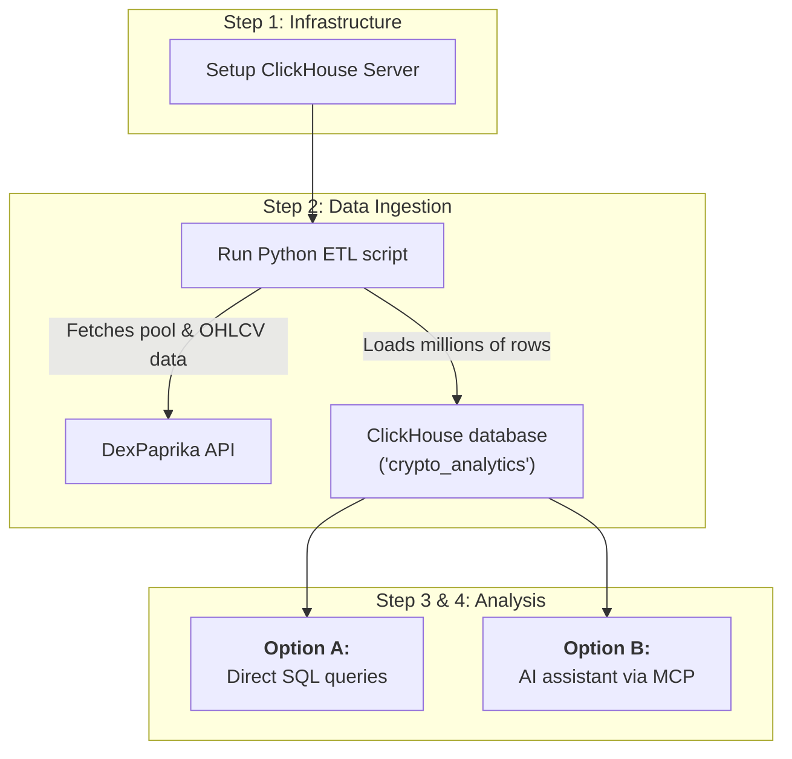

## From local to production scale

When your analytics needs grow beyond a single machine and you require a database designed for production scale, it's time to consider ClickHouse. ClickHouse is built for handling billions of rows with sub-second query times, making it perfect for production analytics, real-time dashboards, and enterprise-grade data analysis.

<Note>
Looking for other analytics solutions? Check out our full list of [API Tutorials](/tutorials/tutorial_intro) for more step-by-step guides.
</Note>

**Why ClickHouse for crypto analytics?**
- **Massive scale:** Built to handle billions of rows and petabytes of data, far beyond the scope of local, in-process databases.
- **Lightning speed:** Optimized columnar storage delivers queries that are 10-100x faster than traditional row-based systems.
- **Real-time ingestion:** Built for continuous data streaming and updates.
- **Production ready:** Used by companies like Uber, Cloudflare, and Spotify for analytics at scale.



**The goal:**
By the end of this guide, you will have a production-grade ClickHouse setup that can:
1. Ingest 15-minute OHLCV data for the top 250 Uniswap v3 pools (7 days of history)
2. Handle real-time data updates via streaming
3. Run complex analytical queries in milliseconds
4. Enable AI-powered analysis through MCP server integration

<CardGroup cols={2}>
  <Card
    title="Step 1: ClickHouse Setup"
    icon="server"
    href="#step-1-setting-up-clickhouse"
  >
    Install and configure ClickHouse for crypto analytics.
  </Card>
  <Card
    title="Step 2: ETL Pipeline"
    icon="arrows-rotate"
    href="#step-2-build-the-production-etl-pipeline"
  >
    Create a robust data pipeline for high-frequency data ingestion.
  </Card>
  <Card
    title="Step 3: Advanced Queries"
    icon="magnifying-glass-chart"
    href="#step-3-lightning-fast-analytics-optional"
  >
    Run complex analytics on 15-minute interval data.
  </Card>
  <Card
    title="Step 4: MCP Integration"
    icon="brain"
    href="#step-4-ai-powered-analysis-with-an-mcp-server"
  >
    Enable AI-powered analysis through MCP server integration.
  </Card>
</CardGroup>

---

## Step 1: Setting up ClickHouse

### **Option A: Local installation (recommended for learning)**

Install ClickHouse locally for development and testing:

```bash
# macOS
brew install clickhouse
```

<Info>
**macOS specifics: Cask installation** <br/>
The `brew install clickhouse` command now installs a Cask, not a standard formula. This provides a single `clickhouse` binary that acts as a multi-tool for both the server and client. Commands that refer to `clickhouse-server` or `brew services` will not work.

Use the following commands instead:

```bash
# To start the server on macOS (runs in the foreground):
clickhouse server

# To connect with the client in a new terminal:
clickhouse client
```
</Info>

```bash
# Ubuntu/Debian
sudo apt-get install -y apt-transport-https ca-certificates dirmngr
sudo apt-key adv --keyserver hkp://keyserver.ubuntu.com:80 --recv 8919F6BD2B48D754
echo "deb https://packages.clickhouse.com/deb stable main" | sudo tee /etc/apt/sources.list.d/clickhouse.list
sudo apt-get update
sudo apt-get install -y clickhouse-server clickhouse-client

# Start the server
sudo systemctl start clickhouse-server
```

### **Option B: ClickHouse Cloud (recommended for production)**

For production workloads, use [ClickHouse Cloud](https://clickhouse.com/cloud):
1. Sign up for a free trial at clickhouse.com/cloud
2. Create a new service
3. Note your connection details (host, port, username, password)

<Note>
**Moving forward:** <br/>
 The rest of this tutorial will assume you are using a **local ClickHouse installation (Option A)**. The Python scripts are configured for this by default. If you choose to use ClickHouse Cloud, remember to update the `CLICKHOUSE_HOST`, `CLICKHOUSE_PORT`, `CLICKHOUSE_USER`, and `CLICKHOUSE_PASSWORD` variables in the scripts accordingly.
</Note>

### **Test your connection**

```bash
# Local installation (macOS)
clickhouse client

# Local installation (Linux)
clickhouse-client

# ClickHouse Cloud
clickhouse-client --host your-host.clickhouse.cloud --port 9440 --user default --password your-password --secure
```

---

## Step 2: Build the production ETL pipeline

Create a new file named `build_clickhouse_db.py`. This script efficiently handles high-frequency data from the top 500 pools, incorporating robust error handling and API management strategies. It leverages two key endpoints: the [Top Pools on a DEX endpoint](/api-reference/pools/get-top-x-pools-on-a-networks-dex) to discover pools, and the [Pool OHLCV Data endpoint](/api-reference/pools/get-ohlcv-data-for-a-pool-pair) to fetch historical price data.

```python build_clickhouse_db.py [expandable]
import requests
import pandas as pd
import clickhouse_connect
from datetime import datetime, timedelta
import logging
import time
import asyncio
import aiohttp
from typing import List, Dict
import json
import math

# --- Configuration ---
API_BASE_URL = "https://api.dexpaprika.com"
NETWORK = "ethereum"
DEX_ID = "uniswap_v3"
HISTORY_DAYS = 7        # Fetch 7 days of OHLCV data
TOP_POOLS_LIMIT = 250   # Focus on top 250 pools by volume
BATCH_SIZE = 15         # Process pools in smaller batches
CONCURRENT_REQUESTS = 4 # Concurrent requests for API calls
OHLCV_API_LIMIT = 100   # API limit for OHLCV requests
INTERVAL = "15m"        # 15-minute intervals

# ClickHouse Configuration
CLICKHOUSE_HOST = "localhost"  # or your ClickHouse Cloud host
CLICKHOUSE_PORT = 8123
CLICKHOUSE_USER = "default"
CLICKHOUSE_PASSWORD = ""      # Set if using ClickHouse Cloud
CLICKHOUSE_DATABASE = "crypto_analytics"

# Setup logging
logging.basicConfig(level=logging.INFO, format='%(asctime)s - %(levelname)s - %(message)s')

async def fetch_with_retry(session, url, params=None, retries=5, backoff_factor=0.5):
    """Generic fetch function with exponential backoff."""
    for attempt in range(retries):
        try:
            async with session.get(url, params=params, timeout=30) as response:
                response.raise_for_status()
                return await response.json()
        except (aiohttp.ClientError, asyncio.TimeoutError) as e:
            if attempt == retries - 1:
                logging.error(f"Final attempt failed for {url}: {e}")
                raise
            sleep_time = backoff_factor * (2 ** attempt)
            logging.warning(f"Request to {url} failed: {e}. Retrying in {sleep_time:.2f}s...")
            await asyncio.sleep(sleep_time)

class ClickHouseETL:
    def __init__(self):
        # Connect without a database first to ensure it exists
        with clickhouse_connect.get_client(
            host=CLICKHOUSE_HOST,
            port=CLICKHOUSE_PORT,
            username=CLICKHOUSE_USER,
            password=CLICKHOUSE_PASSWORD
        ) as client:
            client.command(f"CREATE DATABASE IF NOT EXISTS {CLICKHOUSE_DATABASE}")

        # Now, connect to the specific database for table operations
        self.client = clickhouse_connect.get_client(
            host=CLICKHOUSE_HOST,
            port=CLICKHOUSE_PORT,
            username=CLICKHOUSE_USER,
            password=CLICKHOUSE_PASSWORD,
            database=CLICKHOUSE_DATABASE
        )
        self.api_semaphore = asyncio.Semaphore(CONCURRENT_REQUESTS)
        self.setup_database()
    
    def setup_database(self):
        """Create tables optimized for 15-minute interval data."""
        logging.info("Setting up ClickHouse tables...")
        
        # Create pools table with ReplacingMergeTree to handle duplicates
        pools_schema = """
        CREATE TABLE IF NOT EXISTS pools (
            address String,
            dex_name String,
            volume_24h_usd Float64,
            created_at DateTime,
            token0_symbol Nullable(String),
            token1_symbol Nullable(String),
            pair Nullable(String) MATERIALIZED if(isNotNull(token0_symbol) AND isNotNull(token1_symbol), concat(token0_symbol, '-', token1_symbol), NULL),
            created_date Date MATERIALIZED toDate(created_at),
            volume_rank UInt32
        ) ENGINE = ReplacingMergeTree(created_at)
        ORDER BY (address, volume_24h_usd, created_at)
        PARTITION BY toYYYYMM(created_date)
        """
        self.client.command(pools_schema)
        
        # Create OHLCV table optimized for time-series analytics
        ohlcv_schema = """
        CREATE TABLE IF NOT EXISTS pool_ohlcv (
            timestamp DateTime,
            network String,
            pool_address String,
            open Float64,
            high Float64,
            low Float64,
            close Float64,
            volume_usd Float64,
            date Date MATERIALIZED toDate(timestamp),
            hour UInt8 MATERIALIZED toHour(timestamp),
            minute UInt8 MATERIALIZED toMinute(timestamp),
            quarter_hour UInt8 MATERIALIZED intDiv(toMinute(timestamp), 15)
        ) ENGINE = ReplacingMergeTree(timestamp)
        ORDER BY (pool_address, timestamp)
        PARTITION BY (date, network)
        """
        self.client.command(ohlcv_schema)
        logging.info("Database and tables setup complete.")

    async def fetch_top_pools(self) -> List[Dict]:
        """Fetch top pools by volume from the specified DEX, handling pagination."""
        logging.info(f"Fetching top {TOP_POOLS_LIMIT} pools for {DEX_ID} on {NETWORK}...")
        all_pools = []
        page = 0
        async with aiohttp.ClientSession() as session:
            while len(all_pools) < TOP_POOLS_LIMIT:
                url = f"{API_BASE_URL}/networks/{NETWORK}/dexes/{DEX_ID}/pools"
                params = {"page": page, "limit": 100, "order_by": "volume_usd", "sort": "desc"}
                try:
                    data = await fetch_with_retry(session, url, params=params)
                    pools = data.get('pools', [])
                    if not pools:
                        break
                    all_pools.extend(pools)
                    logging.info(f"Fetched page {page}, got {len(pools)} pools. Total: {len(all_pools)}")
                    page += 1
                    if len(all_pools) >= TOP_POOLS_LIMIT:
                        all_pools = all_pools[:TOP_POOLS_LIMIT]
                        break
                    await asyncio.sleep(0.5) # Be respectful to the API
                except Exception as e:
                    logging.error(f"Error fetching page {page}: {e}")
                    break
        logging.info(f"Finished fetching pools. Total: {len(all_pools)}")
        return all_pools

    async def fetch_pool_ohlcv_paginated(self, session: aiohttp.ClientSession, pool_address: str) -> List[Dict]:
        """Fetch complete OHLCV data for a pool using intelligent, dynamic windowing."""
        async with self.api_semaphore:
            final_end_time = datetime.utcnow()
            current_start_time = final_end_time - timedelta(days=HISTORY_DAYS)
            all_ohlcv = []
            
            try:
                interval_minutes = int(INTERVAL.replace('m', ''))
                minutes_per_call = OHLCV_API_LIMIT * interval_minutes
                time_delta_per_call = timedelta(minutes=minutes_per_call)
            except ValueError:
                logging.error(f"Invalid INTERVAL format: {INTERVAL}. Defaulting to 15 minutes.")
                interval_minutes = 15
                time_delta_per_call = timedelta(minutes=OHLCV_API_LIMIT * 15)

            while current_start_time < final_end_time:
                batch_end_time = min(current_start_time + time_delta_per_call, final_end_time)
                url = f"{API_BASE_URL}/networks/{NETWORK}/pools/{pool_address}/ohlcv"
                params = {
                    "start": current_start_time.strftime('%Y-%m-%dT%H:%M:%SZ'),
                    "end": batch_end_time.strftime('%Y-%m-%dT%H:%M:%SZ'),
                    "interval": INTERVAL,
                    "limit": OHLCV_API_LIMIT
                }
                try:
                    batch_data = await fetch_with_retry(session, url, params=params)
                    if batch_data:
                        for record in batch_data:
                            record['network'] = NETWORK
                            record['pool_address'] = pool_address
                            if 'volume_usd' not in record:
                                avg_price = (record.get('open', 0) + record.get('close', 0)) / 2
                                record['volume_usd'] = record.get('volume', 0) * avg_price if avg_price > 0 else 0
                        all_ohlcv.extend(batch_data)
                except Exception as e:
                    logging.warning(f"Could not fetch OHLCV batch for {pool_address}: {e}")
                
                current_start_time = batch_end_time
                await asyncio.sleep(0.75) # Crucial delay to prevent rate-limiting
            
            logging.info(f"Pool {pool_address}: collected {len(all_ohlcv)} OHLCV records.")
            return all_ohlcv

    async def fetch_pool_ohlcv_batch(self, pool_addresses: List[str]) -> List[Dict]:
        """Fetch OHLCV data for multiple pools concurrently."""
        logging.info(f"Fetching {INTERVAL} OHLCV for {len(pool_addresses)} pools...")
        all_ohlcv = []
        async with aiohttp.ClientSession() as session:
            tasks = [self.fetch_pool_ohlcv_paginated(session, addr) for addr in pool_addresses]
            results = await asyncio.gather(*tasks, return_exceptions=True)
            for i, result in enumerate(results):
                if isinstance(result, list):
                    all_ohlcv.extend(result)
                elif isinstance(result, Exception):
                    logging.warning(f"OHLCV fetch failed for pool {pool_addresses[i]}: {result}")
        return all_ohlcv

    def load_pools_data(self, pools: List[Dict]):
        """Load pools data into ClickHouse with volume ranking."""
        if not pools: return
        logging.info("Processing and loading pools data...")
        for i, pool in enumerate(pools):
            tokens = pool.get('tokens', [])
            pool['token0_symbol'] = tokens[0]['symbol'] if len(tokens) > 0 else None
            pool['token1_symbol'] = tokens[1]['symbol'] if len(tokens) > 1 else None
            pool['volume_rank'] = i + 1
        
        df = pd.DataFrame(pools)
        df = df[['id', 'dex_name', 'volume_usd', 'created_at', 'token0_symbol', 'token1_symbol', 'volume_rank']]
        df = df.rename(columns={'id': 'address', 'volume_usd': 'volume_24h_usd'})
        df['created_at'] = pd.to_datetime(df['created_at'])
        self.client.insert_df('pools', df)
        logging.info(f"Loaded {len(df)} pools into 'pools' table.")

    def load_ohlcv_data(self, ohlcv_data: List[Dict]):
        """Load OHLCV data into ClickHouse."""
        if not ohlcv_data: return
        logging.info(f"Processing and loading {len(ohlcv_data)} OHLCV records...")
        df = pd.DataFrame(ohlcv_data)
        df['timestamp'] = pd.to_datetime(df['time_close'])
        df = df[['timestamp', 'network', 'pool_address', 'open', 'high', 'low', 'close', 'volume_usd']]
        self.client.insert_df('pool_ohlcv', df)
        logging.info(f"Loaded {len(df)} records into 'pool_ohlcv' table.")

    async def run_etl(self):
        """Run the complete ETL process."""
        logging.info(f"Starting ClickHouse ETL process for top {TOP_POOLS_LIMIT} pools...")
        pools = await self.fetch_top_pools()
        if pools:
            self.load_pools_data(pools)
            pool_addresses = [pool['id'] for pool in pools if pool.get('id')]
            for i in range(0, len(pool_addresses), BATCH_SIZE):
                batch_addresses = pool_addresses[i:i + BATCH_SIZE]
                batch_num = (i // BATCH_SIZE) + 1
                total_batches = (len(pool_addresses) + BATCH_SIZE - 1) // BATCH_SIZE
                logging.info(f"Processing OHLCV batch {batch_num}/{total_batches} ({len(batch_addresses)} pools)")
                ohlcv_data = await self.fetch_pool_ohlcv_batch(batch_addresses)
                self.load_ohlcv_data(ohlcv_data)
                if i + BATCH_SIZE < len(pool_addresses):
                    logging.info(f"--- Finished batch {batch_num}, sleeping for 10 seconds ---")
                    await asyncio.sleep(10)
        
        logging.info("ETL process completed!")
        pool_count = self.client.command("SELECT COUNT() FROM pools")
        ohlcv_count = self.client.command("SELECT COUNT() FROM pool_ohlcv")
        unique_pools_with_data = self.client.command("SELECT COUNT(DISTINCT pool_address) FROM pool_ohlcv")
        avg_records = ohlcv_count / unique_pools_with_data if unique_pools_with_data > 0 else 0
        logging.info(f"Final counts - Pools: {pool_count}, OHLCV records: {ohlcv_count:,}")
        logging.info(f"Coverage - {unique_pools_with_data} pools with data, avg {avg_records:.1f} records/pool.")

async def main():
    etl = ClickHouseETL()
    await etl.run_etl()

if __name__ == "__main__":
    # pip install clickhouse-connect aiohttp pandas requests
    asyncio.run(main()) 
```

<Note title="Key insight: Building a production-grade ETL pipeline">
This script is used for performance and reliability, using several good practices common in data pipelines:

- **Asynchronous operations:** By using `asyncio` and `aiohttp`, the script can make many API requests concurrently instead of one by one.
- **Dynamic windowing:** The `fetch_pool_ohlcv_paginated` function calculates how much data to request per API call based on the `OHLCV_API_LIMIT`.
- **Concurrency control & throttling:** An `asyncio.Semaphore`, combined with carefully tuned `BATCH_SIZE` and `asyncio.sleep()` calls, makes sure we don't hit the rate limit.
- **Resiliency:** The `fetch_with_retry` function automatically retries failed requests with an exponential backoff delay.
</Note>

### **Required libraries**
```bash
pip install clickhouse-connect aiohttp pandas requests
```

---

## Step 3: Lightning-fast analytics (Optional)

Once your database is populated, you can query it directly using any ClickHouse-compatible SQL client or a Python script. While the next step (AI Integration) is recommended for the most powerful analysis, running queries directly is a great way to verify your data.

You can create a file named `query_clickhouse.py` to see how fast ClickHouse can process complex analytical queries on the millions of rows you've ingested.

```python query_clickhouse.py [expandable]
import clickhouse_connect
import pandas as pd
import time

client = clickhouse_connect.get_client(
    host='localhost', port=8123, database='crypto_analytics'
)

print("=== ClickHouse 15-Minute Analytics Demo ===\n")

# Query 1: Top Pools by Volume with Data Coverage
print("--- Top 10 Pools by Volume (with data coverage) ---")
start_time = time.time()
result1 = client.query_df("""
    SELECT 
        p.pair,
        p.address,
        max(p.volume_24h_usd) as volume_24h,
        min(p.volume_rank) as best_rank,
        count(o.timestamp) as ohlcv_records
    FROM pools p
    LEFT JOIN pool_ohlcv o ON p.address = o.pool_address
    GROUP BY p.pair, p.address
    ORDER BY volume_24h DESC 
    LIMIT 10
""")
print(result1)
print(f"Query executed in {time.time() - start_time:.3f} seconds\n")

# Query 2: 15-Minute Volume Patterns Analysis
print("--- Volume Patterns by 15-Minute Intervals ---")
result2 = client.query_df("""
    SELECT 
        hour,
        quarter_hour * 15 as minute_of_hour,
        COUNT(DISTINCT pool_address) as active_pools,
        round(avg(volume_usd), 2) as avg_15min_volume,
        round(sum(volume_usd), 2) as total_15min_volume
    FROM pool_ohlcv 
    WHERE volume_usd > 0 AND volume_usd < 1000000000 -- Defensive filter
    GROUP BY hour, quarter_hour 
    ORDER BY total_15min_volume DESC
""")
print(result2.head(10))

# Query 3: High-Frequency Price Action Analysis (Top 5 Pools)
print("\n--- High-Frequency Volatility Analysis (Top 5 Pools) ---")
result3 = client.query_df("""
    WITH top_pools AS (
        SELECT address from pools ORDER BY volume_24h_usd DESC LIMIT 5
    ),
    pool_volatility AS (
        SELECT 
            o.pool_address,
            p.pair,
            (o.high - o.low) / o.low * 100 as interval_volatility
        FROM pool_ohlcv o
        JOIN pools p ON o.pool_address = p.address
        WHERE o.pool_address IN (SELECT address FROM top_pools) AND o.low > 0
    )
    SELECT 
        pair,
        pool_address,
        avg(interval_volatility) as avg_15min_volatility,
        max(interval_volatility) as max_15min_volatility
    FROM pool_volatility
    GROUP BY pair, pool_address
    ORDER BY avg_15min_volatility DESC
""")
print(result3.head(15))

# Query 4: Peak Trading Hours Analysis
print("\n--- Peak Trading Hours Analysis ---")
result4 = client.query_df("""
    SELECT 
        hour,
        COUNT(DISTINCT pool_address) as active_pools,
        round(sum(volume_usd), 2) as hourly_volume,
        round(avg(volume_usd), 2) as avg_15min_volume,
        round(avg((high - low) / low * 100), 4) as avg_volatility_pct
    FROM pool_ohlcv 
    WHERE volume_usd > 0 AND low > 0 AND volume_usd < 1000000000 -- Defensive filter
    GROUP BY hour 
    ORDER BY hourly_volume DESC
""")
print(result4.head(10))

# Query 5: Database performance and storage stats
print("\n--- Database Performance Stats ---")
stats = client.query_df("""
    SELECT 
        table as table_name,
        formatReadableSize(sum(bytes_on_disk)) as size,
        sum(rows) as row_count,
        formatReadableSize(sum(bytes_on_disk)/sum(rows)) as avg_row_size
    FROM system.parts 
    WHERE database = 'crypto_analytics' AND active = 1
    GROUP BY table
""")
print(stats)

# Query 6: Data quality check
print("\n--- Data Quality Summary ---")
quality_check = client.query_df("""
    SELECT 
        'Total Records' as metric, toString(COUNT(*)) as value
    FROM pool_ohlcv
    UNION ALL SELECT 
        'Date Range', concat(toString(MIN(date)), ' to ', toString(MAX(date)))
    FROM pool_ohlcv
    UNION ALL SELECT 
        'Unique Pools with Data', toString(COUNT(DISTINCT pool_address))
    FROM pool_ohlcv
    UNION ALL SELECT 
        'Avg Records per Day', toString(ROUND(COUNT(*) / nullif(COUNT(DISTINCT date), 0)))
    FROM pool_ohlcv
    UNION ALL SELECT 
        'Expected 15min Intervals vs Actual', 
        concat(
            toString(dateDiff('minute', MIN(timestamp), MAX(timestamp)) / 15),
            ' vs ',
            toString(count())
        )
    FROM pool_ohlcv
""")
print(quality_check)
```
You can run the script by executing it from your terminal:

```bash
python query_clickhouse.py
```

Now, let's move on to the recommended final step: connecting your database to an AI assistant.

---

## Step 4: AI-powered analysis with an MCP server

Enable seamless analysis of your local ClickHouse database through the [ClickHouse MCP Server](https://github.com/ClickHouse/mcp-clickhouse). This allows AI assistants like Claude Desktop to connect to your database, list tables, and run `SELECT` queries securely.

### 1. Install the MCP server

The server is a Python package that can be installed via `pip`:

```bash
pip install clickhouse-mcp-server
```

### 2. Configure your AI client

Next, configure your AI client (e.g., Claude Desktop) to use the server. You'll need to edit its configuration file.

- **macOS:** `~/Library/Application Support/Claude/claude_desktop_config.json`
- **Windows:** `%APPDATA%/Claude/claude_desktop_config.json`

Add the following JSON block to the `mcpServers` section of the file. This tells the client how to run the server and provides the connection details for your local ClickHouse instance.

<Info>
**Finding the command path** <br/>
The most common point of failure is an incorrect command path. The command should be the **absolute path** to the `clickhouse-mcp-server` executable that `pip` installed.
Find this path by running `which clickhouse-mcp-server` in your terminal and use the output in the `command` field below.
</Info>

```json
{
  "mcpServers": {
    "clickhouse-mcp-server": {
      "command": "/path/to/your/clickhouse-mcp-server",
      "args": [],
      "env": {
        "CLICKHOUSE_HOST": "localhost",
        "CLICKHOUSE_USER": "default",
        "CLICKHOUSE_PASSWORD": "",
        "CLICKHOUSE_DATABASE": "crypto_analytics",
        "CLICKHOUSE_SECURE": "false"
      }
    }
  }
}
```

### 3. Restart and analyze

Save the configuration file and **restart your AI client**. Once restarted, you can start asking it to analyze the data in your `crypto_analytics` database.

### Troubleshooting & important notes

- **"Server disconnected" error:** This almost always means the `command` path in your configuration is incorrect. Double-check the absolute path using `which clickhouse-mcp-server`.

- **AI connects to the `default` database:** We observed that the AI client might sometimes choose to connect to the `default` database on its own, even if `crypto_analytics` is specified in the config. This will result in it seeing no tables.

- **Solution: Be explicit:** To ensure the AI works correctly, always specify the database in your prompt. This overrides the AI's tendency to use the default.

**Good example prompts:**
- "Using the clickhouse-mcp-server, **connect to the `crypto_analytics` database** and then list the tables."
- "**In the `crypto_analytics` database**, show me the top 10 pools by volume from the `pools` table."
- "Calculate the average daily volume for the top 5 most volatile pools **from the `crypto_analytics` database**."

---

## What you've built: A production-grade analytics pipeline

Congratulations! You've successfully built a scalable crypto analytics pipeline with ClickHouse. You've ingested a large dataset of OHLCV data, and you've enabled a powerful AI assistant to securely query and analyze that data.

**Key achievements:**
- **Built a production-ready ETL pipeline:** You have a reusable, high-performance Python script that can create a comprehensive, multi-million row database from any supported DEX and network.
- **Unlocked lightning-fast SQL:** You can now perform complex analytical queries on a massive dataset in milliseconds, directly on your machine.
- **Mastered a scalable workflow:** This "local-first" data strategy, combined with ClickHouse's power, provides a solid foundation for building real-time dashboards, conducting in-depth market research, and developing sophisticated trading algorithms.
- **Enabled secure AI analysis:** By connecting your database to an AI assistant via an MCP server, you've created a powerful and secure way to explore your data using natural language. 